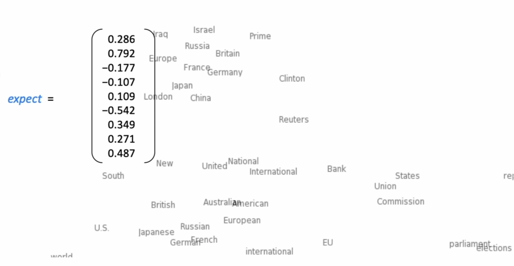
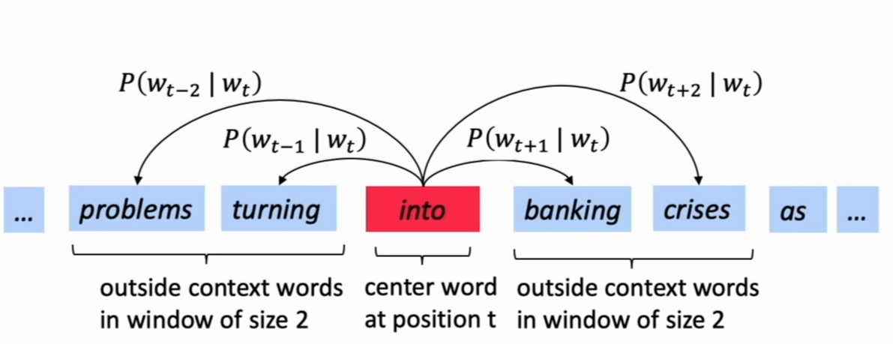
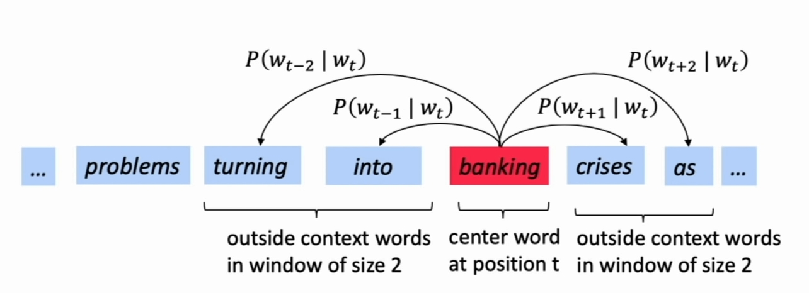

# 
 Week1- Introduction and Word Vectors

斯坦福NLP CS224n 课程笔记
Ref:  [CS224N 官网地址](http://web.stanford.edu/class/cs224n/index.html)

老爷子镇楼 \^_^

[^_^]:
    this is a comment yo.

[//]: <> (this is a comment yo.)

## 1. 如何表示词的含义
首先，在表示词的含义之前，要先明确什么是<b>含义</b>。含义是一个语义符号，它代表着一个事物或者一个想法。有一些nlp工具可以获得词的语义，如WordNet，给出一个词，这些工具可以给出他的词性、近义词、反义词等。

### 独热编码
传统NLP中，词由离散的符号来表示,即独热编码。例如：
旅馆 = [0 0 0 1 0 0 0 0 0 0 0 0 0 0 0 0 0 0 0 0]
啤酒 = [0 0 0 0 0 0 0 0 0 1 0 0 0 0 0 0 0 0 0 0]
如果语料库中有N个词，则每个词由一个N维的one-hot 向量表示。如果词汇量很大，那个将会出现问题。

### 词向量的思想和依据
通过上下文表示词义：
> 'You shall know a word by the company it keeps' (J. R. Firth 1957: 11)

 一个词的含义应该可以由上下文来表示。

由这种思想，我们将一个词表示为一个密度向量，每一位不再是一个0或者1，而是一个小数。例如：
expect=[0.286 0.729 -0.177 ... 0.271 0.487]

词之间的距离可以表示词在语义上的相似性，如上图。

### 词向量的实现
Word2vec(Mikolov et al. 2013) 是实现词嵌入的经典，它的思想是：
- 有一个大的语料库(corpus)
- 每个词由一个向量表示
- 对每个位置$t$，都有一个中心词 $c$ 和其上下文 $context(c)$ 词表示 $o$
- 使用 $c$ 和 $o$ 的词向量的相似性来计算  $p(o|c)$ (反之亦然)
- 通过不断调整词向量，最大化上述概率

如上图，不停地移动迭代，更新词向量，最大化总的条件概率 
具体地，
似然函数为：$$L(\theta) = \prod_{t=1}^T \prod_{-m \le j \le m; j \ne 0} P(w{(t+j} | w_t;\theta)$$
 代价函数为：
$$J(\theta) =- \frac{1}{T} logL(\theta) =- \frac{1}{T}  \prod_{t=1}^T \prod_{-m \le j \le m; j \ne 0}log P(w{(t+j} | w_t;\theta)$$
最小化代价函数 $\iff$ 最大化预测准确率

那么，条件概率$P(o|c)$ 应该如何计算呢？
答案是，先计算相似度，然后$softmax$，即：$p(o|c) = \frac{exp(u_0^Tv_c)}{\sum_{w \in V}exp(u_w^T v_c)}$
其中，每个词有两种词向量，在上下文位置时，使用 $u$ 表示；在中心词位置时，使用 $v$ 表示；分母是所有词汇。

为什么这么计算呢？我们注意到，$u_0^Tv_c$ 表示的是两个向量的点乘，而点乘表示的是向量的余弦相似度，相似度越高，代表两个向量越相近，在词向量空间中，我们认为词向量越相近其所表示的语义越接近。那么上述条件概率描述的其实就是在当前向量表示下，中心词 $c$ 与上下文词 $o$ 的相近程度（语义上的）。再结合我们的优化目标 $L(\theta)$ ,我们可以发现优化过程可以视为不断调整词向量，让不同位置的中心词与窗口内的上下文词的语义的相近程度的和最大。为什么这么做就能得到一个好的词表示呢？回想上小节『词向量的思想和依据』中有讲到， 一个词的含义应该可以由上下文来表示'。我们可以发现其实这样的优化过程的基础思想就是让一个词的含义尽量与上下文的语义相似。

 

